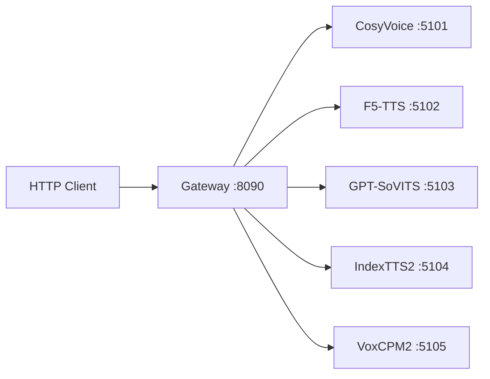

# Local TTS Server

通用本地 TTS 协议服务集合。在多个开源 TTS 引擎外面包一层统一 HTTP API，通过 Gateway 统一代理。

## 架构

```
local-tts-protocol/      共享 Pydantic 协议模型
local-tts-service-kit/   FastAPI 服务装配 + 异常映射 + ProfileStore
local-tts-gateway/       统一网关（子进程管理、adapter 路由）
services/                各 TTS 引擎的协议适配服务
```



## 支持的引擎

| Provider | 默认端口 | 特点 |
|----------|----------|------|
| CosyVoice | 5101 | SFT 预设音色 + zero-shot clone |
| F5-TTS | 5102 | 参考音频驱动 |
| GPT-SoVITS | 5103 | 参考音频驱动，支持 clone |
| IndexTTS2 | 5104 | 参考音频驱动，支持 emotion control |
| VoxCPM2 | 5105 | 文本指令驱动，无需参考音频即可合成 |

## 运行模型 — IndexTTS2 完整步骤

以 IndexTTS2 为例，其他引擎流程类似。

### 1. 克隆项目

```bash
git clone https://github.com/liyaojinone/tts-server.git
cd tts-server
```

### 2. 克隆引擎源码

```bash
git clone https://github.com/index-tts/index-tts.git models/index-tts/repo
```

### 3. 下载模型权重

```bash
pip install modelscope
modelscope download --model IndexTeam/IndexTTS-2 --local_dir models/index-tts/checkpoints
```

> Windows / 国外网络也可以直接：
> ```bash
> pip install huggingface_hub
> huggingface-cli download IndexTeam/IndexTTS --local-dir models/index-tts/checkpoints
> ```

### 3-2. 无外网服务器（从本地上传）

服务器无外网时，在本地将已下好的权重打包上传：

```bash
# 本地打包
cd models/index-tts/repo
tar -czf checkpoints.tar.gz checkpoints/hf_cache/

# 上传到服务器后解压
tar -xzf checkpoints.tar.gz -C /root/tts-server/models/index-tts/repo/
```

### 4. 创建虚拟环境并安装依赖

```bash
# 安装 uv 包管理器
pip install uv

# 进入引擎仓库，一键安装所有依赖
cd models/index-tts/repo
uv sync --default-index https://mirrors.aliyun.com/pypi/simple

# 追加服务层依赖
uv pip install uvicorn fastapi httpx pydantic pyyaml
cd ../..
```

### 5. 设置 HF 镜像（国内服务器必须）

```bash
export HF_ENDPOINT=https://hf-mirror.com
```

### 6. 启动服务

```bash
bash services/index-tts-service/start.sh
```

### 7. 验证运行

```bash
curl http://127.0.0.1:5104/v1/health
# 返回: {"status":"ok","model":"IndexTTS2","version":"local","ready":true}

curl http://127.0.0.1:5104/v1/voices
# 返回音色列表
```

### 8. 合成测试

```bash
curl -sS \
  -H "Content-Type: application/json" \
  -o output.wav \
  -X POST http://127.0.0.1:5104/v1/synthesize \
  -d '{
    "text": "你好，这是一个测试。",
    "voice_id": "index-default",
    "language": "zh",
    "parameters": {
        "reference_audio": "/root/ref.wav",
        "extra": {}
    },
    "output": {"format": "wav"}
  }'
```

## 运行 VoxCPM2

```bash
git clone https://github.com/OpenBMB/VoxCPM.git models/voxcpm/repo
pip install modelscope
modelscope download --model OpenBMB/VoxCPM --local_dir models/voxcpm/checkpoints

pip install uv
cd models/voxcpm/repo
uv sync
uv pip install uvicorn fastapi httpx pydantic pyyaml
cd ../..

bash services/voxcpm-service/start.sh
curl http://127.0.0.1:5105/v1/health
```

## 运行 Gateway（统一入口）

Gateway 依赖 Python 3.10+，需要本地 pip 安装依赖：

```bash
cd local-tts-gateway
pip install fastapi httpx pydantic pyyaml uvicorn
python -m uvicorn app.main:create_app --factory --host 127.0.0.1 --port 8090
```

Gateway 从 `configs/providers/*.yaml` 加载配置，首次请求时自动启动对应子进程。

## API 端点

### Gateway（:8090）

| 方法 | 路径 | 说明 |
|------|------|------|
| GET | `/v1/health` | Gateway 健康检查 |
| GET | `/v1/providers` | 列出所有 provider |
| GET | `/v1/providers/{id}` | 查看 provider 详情 |
| GET | `/v1/providers/{id}/health` | Provider 运行状态 |
| GET | `/v1/providers/{id}/voices` | Provider 音色列表 |
| POST | `/v1/providers/{id}/synthesize` | 合成（指定 provider） |
| POST | `/v1/synthesize` | 合成（body 内指定 provider_id） |
| GET | `/internal/providers/status` | 所有 provider 运行时详情 |
| POST | `/internal/providers/{id}/start` | 启动 provider |
| POST | `/internal/providers/{id}/stop` | 停止 provider |
| POST | `/internal/providers/{id}/restart` | 重启 provider |

### 各引擎服务（:5101 ~ :5105）

| 方法 | 路径 | 说明 |
|------|------|------|
| GET | `/v1/health` | 服务健康检查 |
| GET | `/v1/voices` | 音色列表（含 clone/design profile） |
| POST | `/v1/synthesize` | 合成（支持 JSON 和 multipart） |
| POST | `/v1/clone` | 上传参考音频注册音色 |
| GET | `/v1/clone/{task_id}/status` | 查询 clone 状态 |
| POST | `/v1/design` | 文本指令注册音色（仅 VoxCPM） |

### 认证

设置环境变量 `LOCAL_TTS_API_KEY` 后，所有请求需带 `Authorization: Bearer <key>` 头。

### 合成请求结构

```json
{
    "text":       "合成文本",
    "voice_id":   "音色 ID",
    "language":   "zh",
    "parameters": {
        "speed":             1.0,
        "emotion":           null,
        "instruction":       "音色描述文本（VoxCPM 主要用）",
        "reference_audio":   "参考音频路径",
        "reference_text":    "参考文本",
        "extra": {
            "cfg_value":          2.0,
            "inference_timesteps": 10
        }
    },
    "output": {
        "format":      "wav",
        "sample_rate": null
    }
}
```

## 项目结构

```
tts-server/
├── local-tts-protocol/        共享协议模型
├── local-tts-service-kit/     服务装配框架
├── local-tts-gateway/         统一网关
│   ├── app/adapters/          各引擎请求适配
│   ├── app/routers/           HTTP 路由
│   ├── app/services/          进程管理 & 注册中心
│   ├── app/schemas/           网关层 Pydantic 模型
│   └── configs/providers/     Provider 启动配置 (*.yaml)
├── services/                  各引擎服务实现
│   ├── cosyvoice-service/
│   ├── f5tts-service/
│   ├── gptsovits-service/
│   ├── index-tts-service/
│   └── voxcpm-service/
├── docs/                      设计文档
└── models/                    引擎源码 & 模型权重（不纳入版本控制）
```

## 常见问题

### AutoDL / 云服务器网络加速

AutoDL 内置学术加速，启动服务前执行：

```bash
source /etc/network_turbo
```

这会加速 github.com 和 huggingface.co 的访问，首次启动下载模型依赖时全速。

### CUDA Kernel 加载失败

`Failed to load custom CUDA kernel for BigVGAN` — 缺 ninja，不影响功能，引擎会自动回退 torch 实现。想消除警告可 `pip install ninja`。

### 其他引擎（CosyVoice / F5-TTS / GPT-SoVITS）

这三个引擎引用项目外路径（如 `E:\AiModel\tts\GPT-SoVITS-v2-240821`），需单独安装对应引擎的项目到项目根目录后参照 start.ps1 / start.sh 启动。
