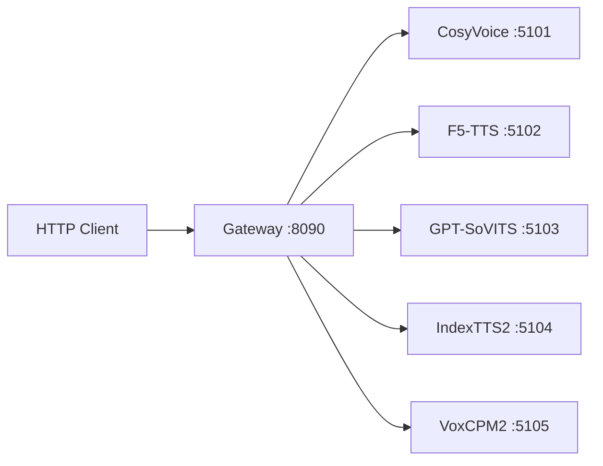

# Local TTS Server

通用本地 TTS 协议服务集合。在多个开源 TTS 引擎外面包一层统一 HTTP API，通过 Gateway 统一代理。

## 架构

```
local-tts-protocol/      共享 Pydantic 协议模型
local-tts-service-kit/   FastAPI 服务装配 + 异常映射 + ProfileStore
local-tts-gateway/       统一网关（子进程管理、adapter 路由）
services/                各 TTS 引擎的协议适配服务
```



## 支持的引擎

| Provider | 默认端口 | 特点 |
|----------|----------|------|
| CosyVoice | 5101 | SFT 预设音色 + zero-shot clone |
| F5-TTS | 5102 | 参考音频驱动 |
| GPT-SoVITS | 5103 | 参考音频驱动，支持 clone |
| IndexTTS2 | 5104 | 参考音频驱动，支持 emotion control |
| VoxCPM2 | 5105 | 文本指令驱动，无需参考音频即可合成 |
| Stable Audio 3 Small-SFX | 5106 | 文本生成音效，统一生成协议 `audio.generate` |

## 三大目标引擎源码布局

GPT-SoVITS、F5-TTS、CosyVoice 的官方源码放在仓库内 `models/` 下：

```text
models/gpt-sovits/repo/
models/f5-tts/repo/
models/cosyvoice/repo/
models/stable-audio-3/repo/
```

`models/` 不纳入版本控制，用于保存本机源码、权重、缓存和输出。本仓库的 `services/*-service/start.ps1` 会默认读取这些源码目录，也支持通过环境变量覆盖：

| 引擎 | 源码环境变量 | Python 环境变量 |
|------|--------------|-----------------|
| CosyVoice | `COSYVOICE_REPO_DIR` | `COSYVOICE_PYTHON` |
| F5-TTS | `F5TTS_REPO_DIR` | `F5TTS_PYTHON` |
| GPT-SoVITS | `GPTSOVITS_REPO_DIR` | `GPTSOVITS_PYTHON` |
| Stable Audio 3 | `STABLE_AUDIO3_REPO_DIR` | `STABLE_AUDIO3_PYTHON` |

当前仅要求源码存在；Python 依赖、模型权重和真实链路测试需要在磁盘空间充足后单独执行。

Stable Audio 3 使用官方仓库 [Stability-AI/stable-audio-3](https://github.com/Stability-AI/stable-audio-3)，当前接入 `stabilityai/stable-audio-3-small-sfx` 对应的 `small-sfx`。Hugging Face 权重需要登录并接受模型条款后才能下载；本仓库不会自动下载权重。

## 运行模型 — IndexTTS2 完整步骤

以 IndexTTS2 为例，其他引擎流程类似。

### 1. 一键初始化

```bash
# AutoDL / 国内云服务器
source /etc/network_turbo    # AutoDL 网络加速
bash setup.sh                # 交互式选择模型，自动完成以下全部
```

`setup.sh` 自动执行三步：

| 步骤 | 做什么 | 方式 |
|------|--------|------|
| 1. 源码仓库 | `git clone` 引擎代码到 `models/index-tts/repo/` | GitHub |
| 2. 模型权重 | 下载主权重到 `models/index-tts/checkpoints/` | ModelScope（国内快） |
| 3. 虚拟环境 | 安装所有 Python 依赖 + 系统库 | `uv sync` + `apt install libsndfile1` |

### 2. 启动服务

```bash
bash services/index-tts-service/start.sh
```

首次启动引擎会从 HuggingFace 自动下载引用的第三方模型（`facebook/w2v-bert-2.0` ~2.3G、`amphion/MaskGCT` ~300M、`funasr/campplus` ~28M、`nvidia/bigvgan`），缓存到 `models/index-tts/repo/checkpoints/hf_cache/`。后续启动不再触网。

> 模型有两批：第一批是你从 ModelScope 下的**主权重**（`gpt.pth` 等，IndexTTS 团队的）；第二批是引擎启动时自动从 HF 拉的**第三方零件**（w2v-bert、MaskGCT 等，其他团队训的）。这是引擎官方代码的行为，不是本项目的额外操作。

### 3. 验证运行

```bash
curl http://127.0.0.1:5104/v1/health
# {"status":"ok","model":"IndexTTS2","version":"local","ready":true}
```

### 4. 合成测试

引擎 examples 目录下的 wav 文件是 Git LFS 指针（ASCII 文本），需生成标准测试文件：

```bash
python3 -c 'import soundfile as sf, numpy as np; sf.write("/tmp/test.wav", np.zeros(16000), 16000)'

curl -sS -H "Content-Type: application/json" -o /tmp/output.wav \
  -X POST http://127.0.0.1:5104/v1/synthesize \
  -d '{"text":"你好，测试成功。","voice_id":"index-default","language":"zh","parameters":{"reference_audio":"/tmp/test.wav","extra":{}},"output":{"format":"wav"}}'
```

## 运行 VoxCPM2

```bash
git clone https://github.com/OpenBMB/VoxCPM.git models/voxcpm/repo
pip install modelscope
modelscope download --model OpenBMB/VoxCPM --local_dir models/voxcpm/checkpoints

pip install uv
cd models/voxcpm/repo
uv sync
uv pip install uvicorn fastapi httpx pydantic pyyaml
cd ../..

bash services/voxcpm-service/start.sh
curl http://127.0.0.1:5105/v1/health
```

## 运行 Gateway（统一入口）

```bash
# 前台（调试）
bash start-gateway.sh 6006

# 后台（生产，关了终端也不停）
bash start-gateway.sh -d 6006

# 查看 Gateway 日志
bash start-gateway.sh --logs
```

Gateway 自动加载对应平台的 provider 配置：

- **Linux**：加载 `indextts-linux.yaml`，跳过 `*-windows.yaml`
- **Windows**：加载 `*-windows.yaml`，跳过 `*-linux.yaml`

Gateway 首次请求时自动启动引擎子进程，也可通过 API 手动控制：

```bash
curl -X POST http://127.0.0.1:6006/v1/providers/local_index_tts/start
curl http://127.0.0.1:6006/v1/providers/status
```

## API 端点

> 完整接口文档见 [docs/services/local-tts-service-endpoints.md](docs/services/local-tts-service-endpoints.md)

### 统一生成 API（新主协议）

| 方法 | 路径 | 说明 |
|------|------|------|
| GET | `/v1/models` | 列出可生成模型与任务能力 |
| GET | `/v1/models/{model_id}` | 查看单个模型的输入、输出与音色能力 |
| POST | `/v1/generate` | 同步生成音频，支持 JSON / multipart / base64 |

TTS 合成使用 `task: "tts.speech"`：

```bash
curl -sS -H "Content-Type: application/json" -o out.wav \
  -X POST http://127.0.0.1:6006/v1/generate \
  -d '{
    "model": "local_f5_tts",
    "task": "tts.speech",
    "input": {"text": "你好", "voice": "f5-default", "language": "zh"},
    "parameters": {
      "reference_audio": {"kind": "path", "path": "E:/audio/ref.wav"},
      "reference_text": "参考文本"
    },
    "output": {"format": "wav", "sample_rate": 24000}
  }'
```

multipart 上传使用 `request` 字段传 JSON，文件字段通过 `FileInput` 引用：

```bash
curl -sS -o out.wav \
  -X POST http://127.0.0.1:6006/v1/generate \
  -F 'request={"model":"local_f5_tts","task":"tts.speech","input":{"text":"你好","voice":"f5-default"},"parameters":{"reference_audio":{"kind":"upload","field":"ref_audio"}}}' \
  -F "ref_audio=@speaker.wav"
```

Stable Audio 3 Small-SFX 音效生成使用 `task: "audio.generate"`：

```bash
curl -sS -H "Content-Type: application/json" -o sfx.wav \
  -X POST http://127.0.0.1:6006/v1/generate \
  -d '{
    "model": "stable-audio-3-small-sfx",
    "task": "audio.generate",
    "input": {"prompt": "short cinematic whoosh impact"},
    "parameters": {"duration": 7, "seed": 1234},
    "output": {"format": "wav", "sample_rate": 44100}
  }'
```

旧的 `/{provider_id}/v1/synthesize`、`/{provider_id}/v1/voices`、`/{provider_id}/v1/clone` 暂时保留，后续等新协议稳定后再逐步废弃。

### Provider ID 对照

| Provider ID | 引擎 | 端口 |
|-------------|------|------|
| `local_index_tts` | IndexTTS2 | 5104 |
| `local_voxcpm` | VoxCPM2 | 5105 |
| `local_gpt_sovits` | GPT-SoVITS | 5103 |
| `local_f5_tts` | F5-TTS | 5102 |
| `local_cosyvoice2` | CosyVoice2 | 5101 |
| `stable_audio_3_small_sfx` | Stable Audio 3 Small-SFX | 5106 |

### Gateway（:6006）

客户端 `baseUrl` 配置为 `http://127.0.0.1:6006/local_index_tts`。

**引擎 API**（`/{provider_id}/v1/*`）：

| 方法 | 路径 | 说明 |
|------|------|------|
| GET | `/{provider_id}/v1/health` | Provider 运行状态 |
| GET | `/{provider_id}/v1/voices` | Provider 音色列表 |
| POST | `/{provider_id}/v1/synthesize` | 合成（JSON / multipart / base64） |
| POST | `/{provider_id}/v1/clone` | 上传参考音频注册音色 |

**管理 API**（`/{provider_id}/v1/*` 或 `/v1/*`）：

| 方法 | 路径 | 说明 |
|------|------|------|
| GET | `/{provider_id}/v1/health` | Provider 运行状态 |
| GET | `/{provider_id}/v1/providers` | 列出所有 provider |
| GET | `/{provider_id}/v1/providers/{id}` | 查看 provider 详情 |
| GET | `/{provider_id}/v1/providers/status` | 所有 provider 运行时状态 |
| POST | `/{provider_id}/v1/providers/{id}/start` | 启动 provider |
| POST | `/{provider_id}/v1/providers/{id}/stop` | 停止 provider |
| POST | `/{provider_id}/v1/providers/{id}/restart` | 重启 provider |
| GET | `/{provider_id}/v1/providers/{id}/logs` | 查看 provider 日志 |
| GET | `/{provider_id}/v1/logs` | 查看 Gateway 日志 |

### 响应头

| Header | 说明 |
|--------|------|
| `X-Provider-Id` | 处理请求的 provider ID |
| `X-Audio-Duration` | 音频时长（秒），下游提供时返回 |
| `X-Sample-Rate` | 采样率（Hz），下游提供时返回 |

### reference_audio 支持的三种格式

`synthesize` 端点的 `parameters.reference_audio` 和 `parameters.extra.emotion_reference_audio` 现在支持：

| 格式 | 示例 | 适用场景 |
|------|------|----------|
| 本地路径 | `"/data/ref.wav"` | 服务器本地已有文件 |
| base64 | `"data:audio/wav;base64,UklGRiQAAABXQVZF..."` | 程序化调用，不搞 multipart |
| multipart 文件 | `-F "reference_audio=@speaker.wav"` | 本地有音频文件，直接上传 |

### 推荐调用流程

**音色复用（推荐）**：注册一次，后续只用 voice_id

```bash
# 1. 注册音色（上传参考音频，得到 voice_id）
curl -sS -X POST http://127.0.0.1:6006/local_index_tts/v1/clone \
  -F "audio=@speaker.wav" \
  -F "name=我的音色" \
  -F "text=参考文本" \
  -F "language=zh"
  -F "emotion=calm"
# 返回: {"voice_id":"wo-de-yin-se","status":"ready",...}

# 2. 后续合成只需 voice_id，不需要 reference_audio
curl -sS -H "Content-Type: application/json" -o out.wav \
  -X POST http://127.0.0.1:6006/local_index_tts/v1/synthesize \
  -d '{"text":"你好","voice_id":"wo-de-yin-se"}'
```

**一次性合成（multipart）**：直接上传音频，无需注册

```bash
curl -sS -o out.wav \
  -X POST http://127.0.0.1:6006/local_index_tts/v1/synthesize \
  -F 'request={"text":"你好","voice_id":"index-default"}' \
  -F "reference_audio=@speaker.wav" \
  -F "emotion_reference_audio=@emo.wav"
```

**程序化调用（base64）**：纯 JSON，不搞文件上传

```bash
REF_B64=$(base64 -w0 speaker.wav)
curl -sS -H "Content-Type: application/json" -o out.wav \
  -X POST http://127.0.0.1:6006/local_index_tts/v1/synthesize \
  -d "{\"text\":\"你好\",\"voice_id\":\"index-default\",\"parameters\":{\"reference_audio\":\"data:audio/wav;base64,$REF_B64\"}}"
```

### 认证

设置环境变量 `LOCAL_TTS_API_KEY` 后，所有请求需带 `Authorization: Bearer <key>` 头。

### 合成请求结构

```json
{
    "text":       "合成文本",
    "voice_id":   "音色 ID",
    "language":   "zh",
    "parameters": {
        "speed":             1.0,
        "pitch":             0.0,
        "volume":            1.0,
        "emotion":           null,
        "emotion_intensity": null,
        "instruction":       "音色描述文本",
        "reference_audio":   "文件路径 / base64 data URI",
        "reference_text":    "参考文本",
        "extra": {
            "emotion_reference_audio": "文件路径 / base64",
            "cfg_value":              2.0,
            "inference_timesteps":     10
        }
    },
    "output": {
        "format":      "wav",
        "sample_rate": null
    }
}
```

### 各引擎服务端点（:5101 ~ :5105）

直连引擎服务时，API 与 Gateway 一致，额外支持：

| 方法 | 路径 | 说明 |
|------|------|------|
| POST | `/v1/clone` | 上传参考音频注册音色（multipart） |
| GET | `/v1/clone/{task_id}/status` | 查询 clone 状态 |
| POST | `/v1/design` | 文本指令注册音色（仅 VoxCPM） |

## 日志

Gateway 和引擎的日志统一输出到 `local-tts-gateway/logs/`：

```
logs/
├── gateway.log                    # Gateway 自身输出
├── local_index_tts/
│   ├── stdout.log                 # 引擎标准输出
│   └── stderr.log                 # 引擎错误日志
└── ...
```

```bash
# 实时查看
tail -f local-tts-gateway/logs/gateway.log
tail -f local-tts-gateway/logs/local_index_tts/stderr.log

# 或通过 API
curl "http://127.0.0.1:6006/v1/logs?lines=50"
curl "http://127.0.0.1:6006/v1/providers/local_index_tts/logs?stream=stderr&lines=50"
```

## 项目结构

```
tts-server/
├── local-tts-protocol/        共享协议模型
├── local-tts-service-kit/     服务装配框架
├── local-tts-gateway/         统一网关
│   ├── app/adapters/          各引擎请求适配
│   ├── app/routers/           HTTP 路由
│   ├── app/services/          进程管理 & 注册中心
│   ├── app/schemas/           网关层 Pydantic 模型
│   └── configs/providers/     Provider 启动配置 (*.yaml)
├── services/                  各引擎服务实现
│   ├── cosyvoice-service/
│   ├── f5tts-service/
│   ├── gptsovits-service/
│   ├── index-tts-service/
│   ├── stable-audio3-service/
│   └── voxcpm-service/
├── docs/                      设计文档
└── models/                    引擎源码 & 模型权重（不纳入版本控制）
```

## 常见问题

### AutoDL 网络加速

```bash
source /etc/network_turbo
```

### soundfile / librosa: "Format not recognised" 或 NoBackendError

缺少系统音频库，已集成到 `setup.sh`。手动安装：

```bash
apt-get install -y libsndfile1
```

### 示例 wav 文件无法读取

引擎 examples 下的 wav 可能是 Git LFS 指针文件（`file xxx.wav` 显示 "ASCII text"）。生成标准测试文件：

```bash
python3 -c 'import soundfile as sf, numpy as np; sf.write("/tmp/test.wav", np.zeros(16000), 16000)'
```

### 首次启动下载第三方模型

首次启动时引擎会从 HuggingFace 自动下载引用的模型（`w2v-bert-2.0` ~2.3G、`MaskGCT` ~300M、`campplus` ~28M），缓存到 `repo/checkpoints/hf_cache/`。确保执行了 `source /etc/network_turbo`，下载后不再触网。

### CUDA Kernel: "Ninja is required"

不影响功能，引擎自动回退 torch 实现。消除警告：`uv pip install ninja`。

### GPU 未使用 / CPU 模式

`uv sync` 安装的 torch CUDA 版本与系统驱动不匹配时，覆盖安装：

```bash
cd models/index-tts/repo
uv pip install torch torchaudio --index-url https://download.pytorch.org/whl/cu124
```

### 其他引擎（CosyVoice / F5-TTS / GPT-SoVITS）

这三个引擎默认读取仓库内 `models/<engine>/repo` 的官方源码。先准备对应 Python 环境和模型权重，再参照 `services/<engine>-service/start.ps1` 启动；不要把权重、缓存或参考音频提交到仓库。

## 常见问题

### AutoDL / 云服务器网络加速

AutoDL 内置学术加速，启动服务前执行：

```bash
source /etc/network_turbo
```

这会加速 github.com 和 huggingface.co 的访问，首次启动下载模型依赖时全速。

### CUDA Kernel 加载失败

`Failed to load custom CUDA kernel for BigVGAN` — 缺 ninja，不影响功能，引擎会自动回退 torch 实现。想消除警告可 `pip install ninja`。

### 其他引擎（CosyVoice / F5-TTS / GPT-SoVITS）

这三个引擎的官方源码默认位于 `models/cosyvoice/repo`、`models/f5-tts/repo`、`models/gpt-sovits/repo`。如果源码或 Python 环境放在其他位置，通过 `COSYVOICE_REPO_DIR`、`F5TTS_REPO_DIR`、`GPTSOVITS_REPO_DIR` 以及对应 `*_PYTHON` 环境变量覆盖。
