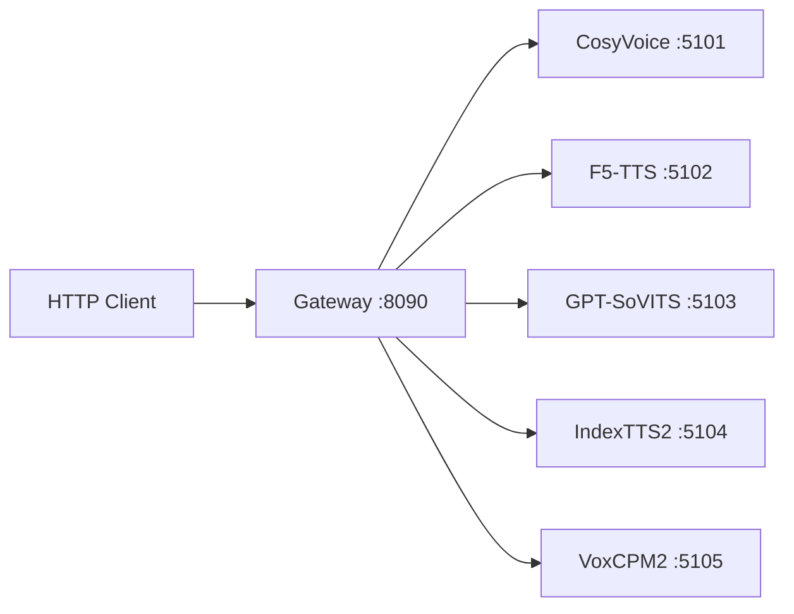

# Local TTS Server

通用本地 TTS 协议服务集合。在多个开源 TTS 引擎外面包一层统一 HTTP API，通过 Gateway 统一代理。

## 架构

```
local-tts-protocol/      共享 Pydantic 协议模型
local-tts-service-kit/   FastAPI 服务装配 + 异常映射 + ProfileStore
local-tts-gateway/       统一网关（子进程管理、adapter 路由）
services/                各 TTS 引擎的协议适配服务
```



## 支持的引擎

| Provider | 默认端口 | 特点 |
|----------|----------|------|
| CosyVoice | 5101 | SFT 预设音色 + zero-shot clone |
| F5-TTS | 5102 | 参考音频驱动 |
| GPT-SoVITS | 5103 | 参考音频驱动，支持 clone |
| IndexTTS2 | 5104 | 参考音频驱动，支持 emotion control |
| VoxCPM2 | 5105 | 文本指令驱动，无需参考音频即可合成 |

## 环境初始化

克隆本仓库后，需要手动下载各 TTS 引擎的代码和模型权重到 `models/` 目录。

### 目录结构

```
models/
├── index-tts/
│   ├── repo/           IndexTTS2 源码（git clone）
│   ├── checkpoints/    模型权重（从 HuggingFace 下载）
│   └── outputs/        合成输出临时目录
└── voxcpm/
    ├── repo/           VoxCPM 源码（git clone）
    ├── checkpoints/    模型权重（从 HuggingFace 下载）
    └── outputs/        合成输出临时目录
```

### 下载引擎源码

```powershell
# IndexTTS2
git clone https://github.com/IndexTeam/IndexTTS.git models/index-tts/repo

# VoxCPM
git clone https://github.com/OpenBMB/VoxCPM.git models/voxcpm/repo
```

### 下载模型权重

IndexTTS2 模型权重仓库为 `IndexTeam/IndexTTS`，VoxCPM 为 `OpenBMB/VoxCPM`。

推荐使用 huggingface-cli 下载：

```powershell
pip install huggingface_hub

# IndexTTS2 权重
huggingface-cli download IndexTeam/IndexTTS --local-dir models/index-tts/checkpoints

# VoxCPM 权重
huggingface-cli download OpenBMB/VoxCPM --local-dir models/voxcpm/checkpoints
```

国内网络可设置镜像：

```powershell
$env:HF_ENDPOINT = "https://hf-mirror.com"
```

### 配置虚拟环境（如有需要）

IndexTTS 的 start.ps1 引用 `models/index-tts/repo/.venv/`，如果引擎自带 venv 不存在则需要自行创建并安装依赖：

```powershell
cd models/index-tts/repo
python -m venv .venv
.venv\Scripts\pip install -e .
```

> VoxCPM 服务的 venv 放在 `services/voxcpm-service/.venv/`，start.ps1 已引用。

## 快速开始

### 1. 启动某个引擎服务

```powershell
cd services/voxcpm-service
.\start.ps1
```

### 2. 或启动 Gateway 统一入口

```powershell
cd local-tts-gateway
python -m uvicorn app.main:create_app --factory --host 127.0.0.1 --port 8090
```

Gateway 会自动从 `configs/providers/*.yaml` 加载 provider 配置，首次请求时懒启动对应子进程。

### 3. 调用合成

```powershell
$body = @{
    provider_id = "voxcpm-default"
    text = "你好，欢迎使用语音合成。"
    voice_id = "voxcpm2-default"
    parameters = @{
        instruction = "用温柔、知性的女声说"
        extra = @{}
    }
    output = @{ format = "wav" }
} | ConvertTo-Json -Depth 6

curl.exe -sS -H "Content-Type: application/json" `
  -o output.wav `
  -X POST http://127.0.0.1:8090/v1/synthesize -d $body
```

## API 端点

### Gateway（:8090）

| 方法 | 路径 | 说明 |
|------|------|------|
| GET | `/v1/health` | Gateway 健康检查 |
| GET | `/v1/providers` | 列出所有 provider |
| GET | `/v1/providers/{id}` | 查看 provider 详情 |
| GET | `/v1/providers/{id}/health` | Provider 运行状态 |
| GET | `/v1/providers/{id}/voices` | Provider 音色列表 |
| POST | `/v1/providers/{id}/synthesize` | 合成（指定 provider） |
| POST | `/v1/synthesize` | 合成（body 内指定 provider_id） |
| GET | `/internal/providers/status` | 所有 provider 运行时详情 |
| POST | `/internal/providers/{id}/start` | 启动 provider |
| POST | `/internal/providers/{id}/stop` | 停止 provider |
| POST | `/internal/providers/{id}/restart` | 重启 provider |

### 各引擎服务（:5101 ~ :5105）

| 方法 | 路径 | 说明 |
|------|------|------|
| GET | `/v1/health` | 服务健康检查 |
| GET | `/v1/voices` | 音色列表（含 clone/design profile） |
| POST | `/v1/synthesize` | 合成（支持 JSON 和 multipart） |
| POST | `/v1/clone` | 上传参考音频注册音色 |
| GET | `/v1/clone/{task_id}/status` | 查询 clone 状态 |
| POST | `/v1/design` | 文本指令注册音色（仅 VoxCPM） |

### 认证

设置环境变量 `LOCAL_TTS_API_KEY` 后，所有请求需带 `Authorization: Bearer <key>` 头。

## 合成请求结构

```json
{
    "text":       "合成文本",
    "voice_id":   "音色 ID",
    "language":   "zh",
    "parameters": {
        "speed":             1.0,
        "emotion":           null,
        "instruction":       "音色描述文本（VoxCPM 主要用）",
        "reference_audio":   "参考音频路径",
        "reference_text":    "参考文本",
        "extra": {
            "cfg_value":          2.0,
            "inference_timesteps": 10
        }
    },
    "output": {
        "format":      "wav",
        "sample_rate": null
    }
}
```

## 项目结构

```
tts-server/
├── local-tts-protocol/        共享协议模型
├── local-tts-service-kit/     服务装配框架
├── local-tts-gateway/         统一网关
│   ├── app/adapters/          各引擎请求适配
│   ├── app/routers/           HTTP 路由
│   ├── app/services/          进程管理 & 注册中心
│   ├── app/schemas/           网关层 Pydantic 模型
│   └── configs/providers/     Provider 启动配置 (*.yaml)
├── services/                  各引擎服务实现
│   ├── cosyvoice-service/
│   ├── f5tts-service/
│   ├── gptsovits-service/
│   ├── index-tts-service/
│   └── voxcpm-service/
├── docs/                      设计文档
└── models/                    引擎原始代码 & 模型权重（不纳入版本控制）
```

## 测试

各子模块独立运行：

```bash
cd local-tts-gateway && python -m pytest tests -v
cd services/index-tts-service && python -m pytest tests -v
```

## 配置

- `configs/providers/*.yaml` — 每个 provider 的启动命令、端口、capabilities、预定义 voices
- `configs/gateway.yaml` — Gateway 自身监听地址
- `LOCAL_TTS_API_KEY` — 可选，API 认证密钥
