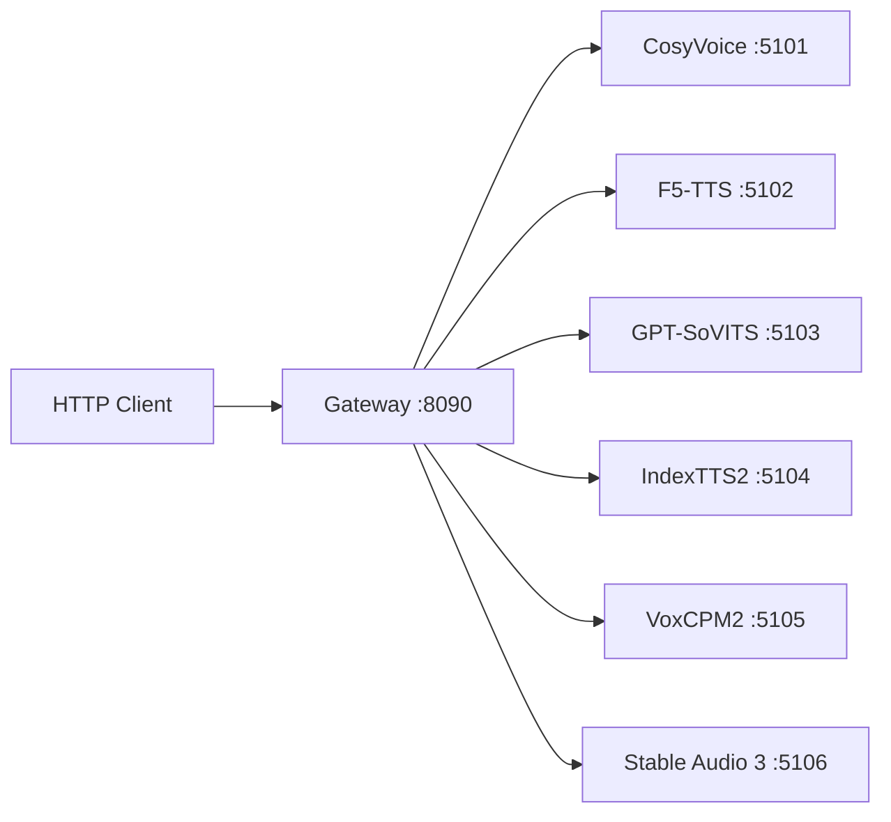

# BoboGen Server

> [!CAUTION]
> ## 自包含运行目录：禁止依赖 BoboGenServer 外部环境
>
> `BoboGenServer` 是独立交付的本地模型服务根目录。Gateway、各模型服务、Python 解释器/虚拟环境、源码、权重、缓存和运行时文件都必须位于**本目录内部**。
>
> - **禁止**借用用户机器上的 Conda 环境、系统 Python、全局 pip 包，或其他项目目录里的模型和权重；
> - **禁止**通过 `COSYVOICE_PYTHON`、`*_REPO_DIR` 等变量把服务指向本目录外；这些变量只允许指向 `BoboGenServer` 内的受管目录；
> - 如果某模型在本目录内找不到解释器、依赖或权重，服务必须明确报“缺少内部运行资源”，不能静默回退到本机其他环境；
> - 面向用户发布前，必须在一台没有开发机遗留环境的机器上验证该目录可独立启动。
>
> 这样可以避免开发机上偶然存在的 Conda/缓存掩盖安装缺失，确保用户拿到的 BoboGenServer 行为一致、可复现。

面向本地和云端模型的统一生成服务。BoboGen 在 TTS、音效、音乐等模型外面包一层稳定 HTTP API，通过 Gateway 统一代理，便于客户端按同一协议接入新模型。

## 客户端与模型服务的版本关系

`BoboGenServer` 是客户端之外的独立本地模型服务。客户端首次安装时通过自己的
用户界面下载它；用户不需要手动安装 Git、Python、Conda 或模型服务。客户端和
服务可以分别更新，开发者只需要维护两者之间的 API 协议关系。

服务按稳定版本发布，不实时跟随 GitHub `main`。每个服务版本都锁定对应的模型
源码、专属 Python 环境和权重版本。服务更新时，模型可能保持不变，也可能随新
发布清单一起更新并重新下载权重；两种情况都必须由发布清单明确记录。模型不能
在后台自行追踪最新版本。

客户端升级默认只更新客户端；只要 API 协议保持兼容，现有服务继续使用。只有在
API 发生不兼容变化或用户主动选择服务更新时，才更新 BoboGenServer。更新失败
必须保留旧的可用版本。完整规则见
[`docs/plans/2026-09-03-client-service-release-lifecycle.md`](docs/plans/2026-09-03-client-service-release-lifecycle.md)。

## 架构

```
bobogen-protocol/      共享 Pydantic 协议模型
bobogen-service-kit/   FastAPI 服务装配 + 异常映射 + ProfileStore
bobogen-gateway/       统一网关（子进程管理、adapter 路由）
services/                各模型的协议适配服务
```


```mermaid
flowchart LR
    A[HTTP Client] --> B[Gateway :8090]
    B --> C[CosyVoice :5101]
    B --> D[F5-TTS :5102]
    B --> E[GPT-SoVITS :5103]
    B --> F[IndexTTS2 :5104]
    B --> G[VoxCPM2 :5105]
    B --> H[Stable Audio 3 :5106]
```

## 支持的模型

| Provider | 默认端口 | 特点 |
|----------|----------|------|
| CosyVoice | 5101 | SFT 预设音色 + zero-shot clone |
| F5-TTS | 5102 | 参考音频驱动 |
| GPT-SoVITS | 5103 | 参考音频驱动，支持 clone |
| IndexTTS2 | 5104 | 参考音频驱动，支持 emotion control |
| VoxCPM2 | 5105 | 文本指令驱动，无需参考音频即可合成 |
| Stable Audio 3 Small-SFX | 5106 | 文本生成音效，统一生成协议 `audio.generate` |
| TIGER-DnR | 5114 | 异步分离对白与全部非对白背景声，统一任务 `audio.separate` |

## 目录铁律：源码/权重与服务环境分离

下面这条是 BoboGenServer 的固定目录约定，所有启动脚本、安装脚本和服务都必须遵守，不能再临时推断：

| 目录 | 只放什么 | 不放什么 |
|------|----------|----------|
| `models/<engine>/repo/` | 上游 GitHub 官方源码及其源码需要的仓库文件 | Python 环境、`.venv` |
| `models/<engine>/checkpoints/` 或官方仓库规定的权重目录 | 模型权重、配置、词表等大文件 | Python 环境、服务代码 |
| `models/<engine>/outputs/` | 该模型的临时生成结果 | 服务环境、源码 |
| `services/<engine>-service/` | BoboGen 协议适配器、启动/健康检查脚本、服务测试和服务数据 | 上游模型源码、模型权重 |
| `services/<engine>-service/.venv/` | **该服务专属 Python 解释器和依赖** | 其他服务的依赖环境 |
| `runtime/` | BoboGen 自带的运行时辅助文件（若有）和 Gateway 任务状态 | 模型源码、模型权重、服务 `.venv` |

以三个本地 TTS 引擎为例，完整对应关系如下：

```text
models/cosyvoice/repo/                         # CosyVoice 官方源码
models/cosyvoice/repo/pretrained_models/       # CosyVoice 权重
services/cosyvoice-service/.venv/              # CosyVoice 专属 Python 环境

models/f5-tts/repo/                            # F5-TTS 官方源码
models/f5-tts/repo/huggingface/hub/            # F5-TTS 上游代码读取的权重/缓存
services/f5tts-service/.venv/                  # F5-TTS 专属 Python 环境

models/gpt-sovits/repo/                        # GPT-SoVITS 官方源码
models/gpt-sovits/checkpoints/gpt_sovits_v2pro/ # GPT-SoVITS V2Pro 权重
services/gptsovits-service/.venv/              # GPT-SoVITS 专属 Python 环境

models/index-tts/repo/                         # IndexTTS 官方源码
models/index-tts/checkpoints/                  # IndexTTS 权重
services/index-tts-service/.venv/              # IndexTTS 专属 Python 环境

models/stable-audio-3/repo/                    # Stable Audio 3 官方源码
models/stable-audio-3/checkpoints/             # Stable Audio 3 权重/缓存
services/stable-audio3-service/.venv/           # Stable Audio 3 专属 Python 环境
```

**禁止把 `.venv` 放进 `models/<engine>/repo/`，也禁止把权重放进 `services/<engine>-service/`。**

### 三大目标引擎源码布局

GPT-SoVITS、F5-TTS、CosyVoice 的官方源码放在仓库内 `models/` 下：

```text
models/gpt-sovits/repo/
models/f5-tts/repo/
models/cosyvoice/repo/
models/stable-audio-3/repo/
```

`models/` 不纳入版本控制，用于保存 BoboGenServer 自己管理的源码、权重、缓存和输出。本仓库的 `services/*-service/start.ps1` 默认读取这些目录。环境变量仅用于在 **BoboGenServer 目录内** 切换受管路径，不能指向 Conda、系统 Python 或其他项目目录：

| 引擎 | 源码环境变量 | Python 环境变量 |
|------|--------------|-----------------|
| CosyVoice | `COSYVOICE_REPO_DIR` | `COSYVOICE_PYTHON` |
| F5-TTS | `F5TTS_REPO_DIR` | `F5TTS_PYTHON` |
| GPT-SoVITS | `GPTSOVITS_REPO_DIR` | `GPTSOVITS_PYTHON` |
| Stable Audio 3 | `STABLE_AUDIO3_REPO_DIR` | `STABLE_AUDIO3_PYTHON` |
| IndexTTS2 | `INDEXTTS_REPO_DIR` | `INDEXTTS_PYTHON` |

每个服务都必须在本目录内具备对应 Python 环境和模型权重；缺失时补齐到该模型自己的受管目录，而不是复用开发机已有环境。

### 已接入的三套本地 TTS 运行资源

下面是当前服务脚本实际读取的固定位置。安装或恢复环境时，先以各 `models/<engine>/repo/README.md` 的上游说明为准，再把结果放到这里；不要自行把路径改到项目外。

| 引擎 | 上游安装依据 | 专属环境 | 服务实际读取的权重位置 | 启动入口 |
|------|--------------|----------|------------------------|----------|
| CosyVoice2 | `models/cosyvoice/repo/README.md`：Python 3.10、`requirements.txt`、`iic/CosyVoice2-0.5B` | `services/cosyvoice-service/.venv/` | `models/cosyvoice/repo/pretrained_models/CosyVoice2-0.5B/` | `services/cosyvoice-service/start.ps1`（5101） |
| F5-TTS | `models/f5-tts/repo/README.md`：Python ≥3.10、项目 editable install、`SWivid/F5-TTS` 与 `charactr/vocos-mel-24khz` | `services/f5tts-service/.venv/` | `models/f5-tts/repo/huggingface/hub/`（上游代码的 Hugging Face cache） | `services/f5tts-service/start.ps1`（5102） |
| GPT-SoVITS V2Pro | `models/gpt-sovits/repo/install.ps1`：Python 3.10、`extra-req.txt`、`requirements.txt`、`XXXXRT/GPT-SoVITS-Pretrained` | `services/gptsovits-service/.venv/` | `models/gpt-sovits/checkpoints/gpt_sovits_v2pro/`：`s1v3.ckpt`、`v2Pro/s2Gv2Pro.pth`、`sv/pretrained_eres2netv2w24s4ep4.ckpt`、`chinese-roberta-wwm-ext-large/`、`chinese-hubert-base/` | `services/gptsovits-service/start.ps1`（5103） |

三套服务均由各自 `start.ps1` 写入只属于本次服务进程的环境变量，例如 `*_REPO_DIR`、`*_MODEL_DIR`、`*_PYTHON`。这些是启动脚本的内部配置，不要求用户在系统环境变量中长期配置。

Stable Audio 3 使用官方仓库 [Stability-AI/stable-audio-3](https://github.com/Stability-AI/stable-audio-3)，当前接入 `stabilityai/stable-audio-3-small-sfx` 对应的 `small-sfx`。Hugging Face 权重需要登录并接受模型条款后才能下载；本仓库不会自动下载权重。

## 运行模型 — IndexTTS2 完整步骤

以 IndexTTS2 为例，其他引擎流程类似。

### 1. 一键初始化

```bash
# AutoDL / 国内云服务器
source /etc/network_turbo    # AutoDL 网络加速
bash install.sh              # 交互式选择模型，自动完成以下全部
```

`install.sh` 自动执行三步：

| 步骤 | 做什么 | 方式 |
|------|--------|------|
| 1. 源码仓库 | `git clone` 引擎代码到 `models/index-tts/repo/` | GitHub |
| 2. 模型权重 | 下载主权重到 `models/index-tts/checkpoints/` | ModelScope（国内快） |
| 3. 虚拟环境 | 安装所有 Python 依赖 + 系统库 | `uv sync` + `apt install libsndfile1` |

### 2. 启动服务

```bash
bash services/index-tts-service/start.sh
```

首次启动引擎会从 HuggingFace 自动下载引用的第三方模型（`facebook/w2v-bert-2.0` ~2.3G、`amphion/MaskGCT` ~300M、`funasr/campplus` ~28M、`nvidia/bigvgan`），缓存到 `models/index-tts/repo/checkpoints/hf_cache/`。后续启动不再触网。

> 模型有两批：第一批是你从 ModelScope 下的**主权重**（`gpt.pth` 等，IndexTTS 团队的）；第二批是引擎启动时自动从 HF 拉的**第三方零件**（w2v-bert、MaskGCT 等，其他团队训的）。这是引擎官方代码的行为，不是本项目的额外操作。

### 3. 验证运行

```bash
curl http://127.0.0.1:5104/v1/health
# {"status":"ok","model":"IndexTTS2","version":"local","ready":true}
```

### 4. 合成测试

引擎 examples 目录下的 wav 文件是 Git LFS 指针（ASCII 文本），需生成标准测试文件：

```bash
python3 -c 'import soundfile as sf, numpy as np; sf.write("/tmp/test.wav", np.zeros(16000), 16000)'

curl -sS -H "Content-Type: application/json" -o /tmp/output.wav \
  -X POST http://127.0.0.1:5104/v1/synthesize \
  -d '{"text":"你好，测试成功。","voice_id":"index-default","language":"zh","parameters":{"reference_audio":"/tmp/test.wav","extra":{}},"output":{"format":"wav"}}'
```

## 运行 VoxCPM2

```bash
git clone https://github.com/OpenBMB/VoxCPM.git models/voxcpm/repo
pip install modelscope
modelscope download --model OpenBMB/VoxCPM --local_dir models/voxcpm/checkpoints

pip install uv
cd models/voxcpm/repo
uv sync
uv pip install uvicorn fastapi httpx pydantic pyyaml
cd ../..

bash services/voxcpm-service/start.sh
curl http://127.0.0.1:5105/v1/health
```

## 运行 Gateway（统一入口）

```bash
# 前台（调试）
bash start.sh -p 6006

# 后台（生产，关了终端也不停）
bash start.sh -d -p 6006

# 查看 Gateway 日志
bash start.sh --logs
```

Gateway 自动加载对应平台的 provider 配置：

- **Linux**：加载 `*-linux.yaml` 和通用配置，跳过 `*-windows.yaml` / `*-docker.yaml`
- **Windows**：加载 `*-windows.yaml` 和通用配置，跳过 `*-linux.yaml` / `*-docker.yaml`
- **Docker**：设置 `BOBOGEN_DEPLOYMENT=docker` 后只加载 `*-docker.yaml`

Gateway 首次请求时自动启动引擎子进程，也可通过 API 手动控制：

```bash
curl -X POST http://127.0.0.1:6006/v1/providers/index_tts_2/start
curl http://127.0.0.1:6006/v1/providers/status
```

## Docker Compose 部署

Docker 是标准部署路径之一。Compose 默认只启动 Gateway；模型服务放在 profile 中，按需启动，不会在 Gateway 启动时占用显存。

```bash
# 只启动 Gateway
bash start.sh --docker -d

# 按需启动 Stable Audio 3 容器
bash start.sh --docker --model stable-audio3

# 查看容器状态和 provider 状态
bash start.sh --docker --status

# 停止 Docker 部署
bash start.sh --docker --stop
```

等价的原生命令：

```bash
docker compose up -d gateway
docker compose --profile stable-audio3 up -d stable-audio3
docker compose --profile stable-audio3 down
```

Linux CUDA 服务器需要先安装 NVIDIA Driver 和 NVIDIA Container Toolkit；Docker Compose 会把 GPU 暴露给 `stable-audio3` 服务。Stable Audio 3 权重是 Hugging Face gated 模型，需先接受 `stabilityai/stable-audio-3-small-sfx` 条款，并提供 `HF_TOKEN` 或在容器/宿主环境完成 `huggingface-cli login`。权重和缓存通过 volume 保存在 `models/stable-audio-3/`，不会进入镜像。

Docker 模式下 Gateway 不挂载 Docker socket，也不在容器内拉起其他容器。若直接调用 `/v1/providers/stable_audio_3_small_sfx/start` 且模型容器尚未启动，Gateway 会返回提示，要求执行：

```bash
bash start.sh --docker --model stable-audio3
```

## API 端点

> 完整接口文档见 [docs/services/bobogen-api-reference.md](docs/services/bobogen-api-reference.md)

Gateway 会自动暴露 OpenAPI 协议文档：

```text
http://127.0.0.1:6006/openapi.json
http://127.0.0.1:6006/docs
http://127.0.0.1:6006/redoc
```

Postman 或 Apifox 直接导入 `http://127.0.0.1:6006/openapi.json` 即可看到新统一接口、Provider 管理接口和旧兼容接口分类。`/v1/generate` 的 `input` / `parameters` 是按模型变化的动态 dict，调参前优先请求 `/v1/models/{model_id}` 查看该模型的 `input_schema`、`parameters_schema` 和示例。生成接口返回 WAV 二进制；在 Postman 中请使用 **Send and Download** 或保存响应到文件后试听。

### 统一生成 API（新主协议）

| 方法 | 路径 | 说明 |
|------|------|------|
| GET | `/v1/models` | 列出可生成模型与任务能力 |
| GET | `/v1/models/{model_id}` | 查看单个模型的输入、输出与音色能力 |
| POST | `/v1/generate` | 同步生成音频，支持 JSON / multipart / base64 |

TTS 合成使用 `task: "tts.speech"`：

```bash
curl -sS -H "Content-Type: application/json" -o out.wav \
  -X POST http://127.0.0.1:6006/v1/generate \
  -d '{
    "model": "f5_tts",
    "task": "tts.speech",
    "input": {"text": "你好", "voice": "f5-default", "language": "zh"},
    "parameters": {
      "reference_audio": {"kind": "path", "path": "E:/audio/ref.wav"},
      "reference_text": "参考文本"
    },
    "output": {"format": "wav", "sample_rate": 24000}
  }'
```

multipart 上传使用 `request` 字段传 JSON，文件字段通过 `FileInput` 引用：

```bash
curl -sS -o out.wav \
  -X POST http://127.0.0.1:6006/v1/generate \
  -F 'request={"model":"f5_tts","task":"tts.speech","input":{"text":"你好","voice":"f5-default"},"parameters":{"reference_audio":{"kind":"upload","field":"ref_audio"}}}' \
  -F "ref_audio=@speaker.wav"
```

Stable Audio 3 Small-SFX 音效生成使用 `task: "audio.generate"`：

```bash
curl -sS -H "Content-Type: application/json" -o sfx.wav \
  -X POST http://127.0.0.1:6006/v1/generate \
  -d '{
    "model": "stable_audio_3_small_sfx",
    "task": "audio.generate",
    "input": {"prompt": "short cinematic whoosh impact"},
    "parameters": {"duration": 7, "seed": 1234},
    "output": {"format": "wav", "sample_rate": 44100}
  }'
```

旧的 `/{provider_id}/v1/synthesize`、`/{provider_id}/v1/voices`、`/{provider_id}/v1/clone` 暂时保留，后续等新协议稳定后再逐步废弃。

### Provider ID 对照

| Provider ID | 引擎 | 端口 |
|-------------|------|------|
| `index_tts_2` | IndexTTS2 | 5104 |
| `voxcpm2` | VoxCPM2 | 5105 |
| `gpt_sovits_v2pro` | GPT-SoVITS | 5103 |
| `f5_tts` | F5-TTS | 5102 |
| `cosyvoice2` | CosyVoice2 | 5101 |
| `stable_audio_3_small_sfx` | Stable Audio 3 Small-SFX | 5106 |
| `tiger_dnr` | TIGER-DnR | 5114 |

### 本地 TTS 版本与资产隔离

`provider_type` 保持引擎家族标识，`provider_id` 和 `model_id` 表示可独立升级的具体版本。当前本地 TTS 映射如下：

| provider_id / model_id | provider_type | 配置端口 |
|------------------------|---------------|----------|
| `cosyvoice2` | `cosyvoice` | 5101 |
| `f5_tts` | `f5-tts` | 5102 |
| `gpt_sovits_v2pro` | `gptsovits` | 5103 |
| `index_tts_2` | `indextts` | 5104 |
| `voxcpm2` | `voxcpm` | 5105 |

`gpt_sovits_v2pro` 只接受显式传入且版本匹配的本地资产：`s1v3.ckpt`、`v2Pro/s2Gv2Pro.pth`、BERT、CN-HuBERT 和 `sv/pretrained_eres2netv2w24s4ep4.ckpt`，均位于 `models/gpt-sovits/checkpoints/gpt_sovits_v2pro/`。路径缺失时服务会明确失败，不扫描或回退到其他版本。`voxcpm2` 显式使用现有 `models/voxcpm/checkpoints/` 中的 `config.json`、`model.safetensors`、`audiovae.pth` 与 `tokenizer.json`；其 profile/output 路径按版本隔离。此次源码升级未下载或替换任何模型 checkpoint。

### Gateway（:6006）

客户端 `baseUrl` 配置为 `http://127.0.0.1:6006/index_tts_2`。

**引擎 API**（`/{provider_id}/v1/*`）：

| 方法 | 路径 | 说明 |
|------|------|------|
| GET | `/{provider_id}/v1/health` | Provider 运行状态 |
| GET | `/{provider_id}/v1/voices` | Provider 音色列表 |
| POST | `/{provider_id}/v1/synthesize` | 合成（JSON / multipart / base64） |
| POST | `/{provider_id}/v1/clone` | 上传参考音频注册音色 |

**管理 API**（`/{provider_id}/v1/*` 或 `/v1/*`）：

| 方法 | 路径 | 说明 |
|------|------|------|
| GET | `/{provider_id}/v1/health` | Provider 运行状态 |
| GET | `/{provider_id}/v1/providers` | 列出所有 provider |
| GET | `/{provider_id}/v1/providers/{id}` | 查看 provider 详情 |
| GET | `/{provider_id}/v1/providers/status` | 所有 provider 运行时状态 |
| POST | `/{provider_id}/v1/providers/{id}/start` | 启动 provider |
| POST | `/{provider_id}/v1/providers/{id}/stop` | 停止 provider |
| POST | `/{provider_id}/v1/providers/{id}/restart` | 重启 provider |
| GET | `/{provider_id}/v1/providers/{id}/logs` | 查看 provider 日志 |
| GET | `/{provider_id}/v1/logs` | 查看 Gateway 日志 |

### 响应头

| Header | 说明 |
|--------|------|
| `X-Provider-Id` | 处理请求的 provider ID |
| `X-Audio-Duration` | 音频时长（秒），下游提供时返回 |
| `X-Sample-Rate` | 采样率（Hz），下游提供时返回 |

### reference_audio 支持的三种格式

`synthesize` 端点的 `parameters.reference_audio` 和 `parameters.extra.emotion_reference_audio` 现在支持：

| 格式 | 示例 | 适用场景 |
|------|------|----------|
| 本地路径 | `"/data/ref.wav"` | 服务器本地已有文件 |
| base64 | `"data:audio/wav;base64,UklGRiQAAABXQVZF..."` | 程序化调用，不搞 multipart |
| multipart 文件 | `-F "reference_audio=@speaker.wav"` | 本地有音频文件，直接上传 |

### 推荐调用流程

**音色复用（推荐）**：注册一次，后续只用 voice_id

```bash
# 1. 注册音色（上传参考音频，得到 voice_id）
curl -sS -X POST http://127.0.0.1:6006/index_tts_2/v1/clone \
  -F "audio=@speaker.wav" \
  -F "name=我的音色" \
  -F "text=参考文本" \
  -F "language=zh"
  -F "emotion=calm"
# 返回: {"voice_id":"wo-de-yin-se","status":"ready",...}

# 2. 后续合成只需 voice_id，不需要 reference_audio
curl -sS -H "Content-Type: application/json" -o out.wav \
  -X POST http://127.0.0.1:6006/index_tts_2/v1/synthesize \
  -d '{"text":"你好","voice_id":"wo-de-yin-se"}'
```

**一次性合成（multipart）**：直接上传音频，无需注册

```bash
curl -sS -o out.wav \
  -X POST http://127.0.0.1:6006/index_tts_2/v1/synthesize \
  -F 'request={"text":"你好","voice_id":"index-default"}' \
  -F "reference_audio=@speaker.wav" \
  -F "emotion_reference_audio=@emo.wav"
```

**程序化调用（base64）**：纯 JSON，不搞文件上传

```bash
REF_B64=$(base64 -w0 speaker.wav)
curl -sS -H "Content-Type: application/json" -o out.wav \
  -X POST http://127.0.0.1:6006/index_tts_2/v1/synthesize \
  -d "{\"text\":\"你好\",\"voice_id\":\"index-default\",\"parameters\":{\"reference_audio\":\"data:audio/wav;base64,$REF_B64\"}}"
```

### 认证

设置环境变量 `BOBOGEN_API_KEY` 后，所有请求需带 `Authorization: Bearer <key>` 头。

### 合成请求结构

```json
{
    "text":       "合成文本",
    "voice_id":   "音色 ID",
    "language":   "zh",
    "parameters": {
        "speed":             1.0,
        "pitch":             0.0,
        "volume":            1.0,
        "emotion":           null,
        "emotion_intensity": null,
        "instruction":       "音色描述文本",
        "reference_audio":   "文件路径 / base64 data URI",
        "reference_text":    "参考文本",
        "extra": {
            "emotion_reference_audio": "文件路径 / base64",
            "cfg_value":              2.0,
            "inference_timesteps":     10
        }
    },
    "output": {
        "format":      "wav",
        "sample_rate": null
    }
}
```

### 各引擎服务端点（:5101 ~ :5105）

直连引擎服务时，API 与 Gateway 一致，额外支持：

| 方法 | 路径 | 说明 |
|------|------|------|
| POST | `/v1/clone` | 上传参考音频注册音色（multipart） |
| GET | `/v1/clone/{task_id}/status` | 查询 clone 状态 |
| POST | `/v1/design` | 文本指令注册音色（仅 VoxCPM） |

## 日志

Gateway 和引擎的日志统一输出到 `bobogen-gateway/logs/`：

```
logs/
├── gateway.log                    # Gateway 自身输出
├── index_tts_2/
│   ├── stdout.log                 # 引擎标准输出
│   └── stderr.log                 # 引擎错误日志
└── ...
```

```bash
# 实时查看
tail -f bobogen-gateway/logs/gateway.log
tail -f bobogen-gateway/logs/index_tts_2/stderr.log

# 或通过 API
curl "http://127.0.0.1:6006/v1/logs?lines=50"
curl "http://127.0.0.1:6006/v1/providers/index_tts_2/logs?stream=stderr&lines=50"
```

## 项目结构

```
bobogen-server/
├── bobogen-protocol/        共享协议模型
├── bobogen-service-kit/     服务装配框架
├── bobogen-gateway/         统一网关
│   ├── app/adapters/          各引擎请求适配
│   ├── app/routers/           HTTP 路由
│   ├── app/services/          进程管理 & 注册中心
│   ├── app/schemas/           网关层 Pydantic 模型
│   └── configs/providers/     Provider 启动配置 (*.yaml)
├── services/                  各引擎服务实现
│   ├── cosyvoice-service/
│   ├── f5tts-service/
│   ├── gptsovits-service/
│   ├── index-tts-service/
│   ├── stable-audio3-service/
│   └── voxcpm-service/
├── docs/                      设计文档
└── models/                    引擎源码 & 模型权重（不纳入版本控制）
```

## 常见问题

### AutoDL 网络加速

```bash
source /etc/network_turbo
```

### soundfile / librosa: "Format not recognised" 或 NoBackendError

缺少系统音频库，已集成到 `install.sh`。手动安装：

```bash
apt-get install -y libsndfile1
```

### 示例 wav 文件无法读取

引擎 examples 下的 wav 可能是 Git LFS 指针文件（`file xxx.wav` 显示 "ASCII text"）。生成标准测试文件：

```bash
python3 -c 'import soundfile as sf, numpy as np; sf.write("/tmp/test.wav", np.zeros(16000), 16000)'
```

### 首次启动下载第三方模型

首次启动时引擎会从 HuggingFace 自动下载引用的模型（`w2v-bert-2.0` ~2.3G、`MaskGCT` ~300M、`campplus` ~28M），缓存到 `repo/checkpoints/hf_cache/`。确保执行了 `source /etc/network_turbo`，下载后不再触网。

### CUDA Kernel: "Ninja is required"

不影响功能，引擎自动回退 torch 实现。消除警告：`uv pip install ninja`。

### GPU 未使用 / CPU 模式

`uv sync` 安装的 torch CUDA 版本与系统驱动不匹配时，覆盖安装：

```bash
cd models/index-tts/repo
uv pip install torch torchaudio --index-url https://download.pytorch.org/whl/cu124
```

### 其他引擎（CosyVoice / F5-TTS / GPT-SoVITS）

这三个引擎默认读取仓库内 `models/<engine>/repo` 的官方源码。先准备对应 Python 环境和模型权重，再参照 `services/<engine>-service/start.ps1` 启动；不要把权重、缓存或参考音频提交到仓库。

## 常见问题

### AutoDL / 云服务器网络加速

AutoDL 内置学术加速，启动服务前执行：

```bash
source /etc/network_turbo
```

这会加速 github.com 和 huggingface.co 的访问，首次启动下载模型依赖时全速。

### CUDA Kernel 加载失败

`Failed to load custom CUDA kernel for BigVGAN` — 缺 ninja，不影响功能，引擎会自动回退 torch 实现。想消除警告可 `pip install ninja`。

### 其他引擎（CosyVoice / F5-TTS / GPT-SoVITS）

这三个引擎的官方源码固定在 `models/cosyvoice/repo`、`models/f5-tts/repo`、`models/gpt-sovits/repo`，服务专属 Python 环境固定在各自的 `services/*-service/.venv`。启动脚本会设置对应变量，变量覆盖只允许切换到 `BoboGenServer` 内的受管路径，不能指向系统 Python、Conda 或其他项目。
