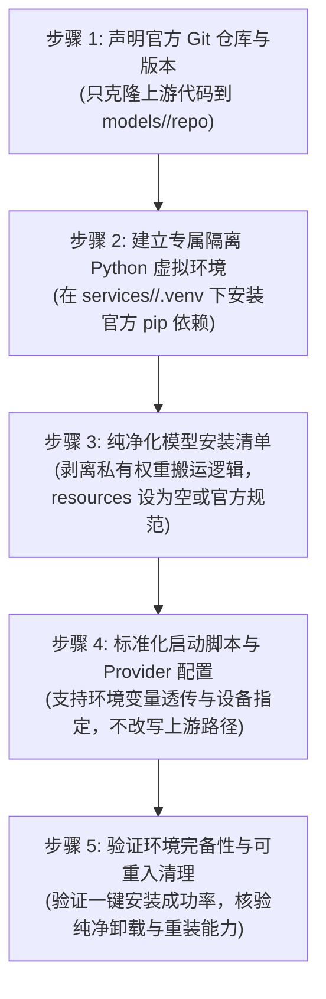

# 通用模型接入、环境构建与全流程规范（Agent 核心指导计划书）

> **适用范围**：本规范立足**第一性原理**与 **KISS（简洁至上）原则**，适用于 BoboGenServer 平台下**所有模型**（包括语音合成 TTS、语音识别 ASR、声音对齐 Align、声音克隆 Clone、音效音乐生成及后续多模态模型）。
> **核心用途**：作为后续所有 Agent 推进工程落地、领用模型接入任务、排查故障及验证链路闭环的**核心参考文件与标准作业程序（SOP）**。

## 零、执行审计结论与“先冻结后验收”规则（2026-09-07）

本文件规定的是最终验收标准，不应被误读为对历史执行过程的追认。上一轮全量模型任务的实际过程是“先用现有实现和已有目录/缓存执行，在前端启动、预热或真实请求中发现问题，再修改 BoboGenServer 自己的适配层、启动脚本、Provider 配置或安装器，随后重新运行验证”。上游 `models/*/repo` 没有被有意改写，但平台代码确实在运行失败之后发生过修改。

因此上一轮结果只能标记为 **“调试/修复后通过”**，不能自动标记为 **“从零验收通过”**。最后一次请求成功，只能证明当时那份“已经修过的代码 + 已存在的仓库/环境/缓存/权重”可以工作，不能证明最终代码冻结前后的完整安装链路从零可重现。

后续每个模型必须分成两条记录：

- **调试通过**：允许使用已有状态并在失败后修复平台代码，修复后通过前端复测；
- **从零验收通过**：最终代码和配置冻结后，只清理用户选中的一个模型，在前端重新完成“下载官方仓库 → 准备 Python 环境 → 安装官方依赖”，再从前端启动，让官方运行时首次自行下载/缓存/加载权重，并保存完整日志。

清理动作必须先限定模型和目录范围，不能批量删除其他模型，也不能把清理残留当成安装成功。安装阶段若出现平台自己的 `resources` 权重下载、路径搬运或镜像没有传递到实际下载进程，应先记录为 SOP 偏差，不得用最终运行成功掩盖。

关于下载源、环境变量和硬编码地址的逐模型事实，见：[模型下载源、运行时权重与流程复盘审计](MODEL_DOWNLOAD_SOURCE_AUDIT.md)。该审计文档也明确区分了 Hugging Face、ModelScope、PyPI、Git、raw URL 和本地缓存这几条独立下载链；“用户可配置镜像”不能默认理解为一个变量覆盖全部链路。

---

## 一、核心准则：什么叫做“做好”？（最高判定标准）

**“做好”的唯一标的，就是模型在我们这套新流程体系下全部跑通。**

1. **新体系核心定义**：
   - **安装阶段**：平台只负责将官方 GitHub 仓库代码克隆至 `models/<model>/repo`，创建专属隔离的 Python 虚拟环境 `services/<service>/.venv`，严格执行官方文档规定的依赖安装命令；
   - **权重管理**：严禁在安装阶段私有下载、搬运、改名、重写权重文件或建立平台私有权重目录，权重留给官方运行时原生机制处理；
   - **不侵入源码**：不改写官方上游代码，不改写其相对路径，保持官方仓库纯正的“可 DIY 底子”；
   - **环境完备性**：服务拥有独立完备的环境，能够被统一网关与启动脚本正确调度。

2. **底线判据（绝对红线）**：
   - **只要不在我们这套新流程体系下面的，哪怕本地已经把几十 GB 的权重文件都下载好了，在新体系下也统统不算“做好”**；
   - 只有完整按新流程建立起官方源码仓库、专属 `.venv` 虚拟环境、跑通安装与标准化启动协议的，才算进入“做好”的标准范畴。

---

## 二、历史上已完成调试的 3 个标杆模型（不等于从零验收）

下面 3 个模型是历史上优先完成过环境配置和端到端调试的标杆，适合作为后续实现参考；按本文件新增的审计规则，它们当前只能标记为 **“调试/修复后通过”**。除非重新完成“最终代码冻结 → 只清理选中模型 → 前端从零安装 → 官方运行时首次下载/加载权重”的阶段 B 验收，否则不能把下面的勾选解释成“从零验收通过”。

### 1. Qwen3-ASR 0.6B（语音识别标杆）
- **模型标识**：`qwen3_asr_0_6b`
- **任务类型**：`asr.transcribe`（离线语音识别转录）
- **官方仓库**：[QwenLM/Qwen3-ASR](https://github.com/QwenLM/Qwen3-ASR)
- **服务端口**：`5110`（服务目录：`services/qwen3-asr-service`）
- **历史调试记录**：
  - [x] 克隆官方上游仓库至 `models/qwen3-asr/repo`；
  - [x] 构建专属 Python 隔离虚拟环境 `services/qwen3-asr-service/.venv`，官方依赖全部安装就绪；
  - [x] 启动脚本 `start.ps1` 标准化透传环境与设备参数；
  - [x] 已完成端到端推理实测验证，转录成功。

### 2. Qwen3 Forced Aligner 0.6B（音字对齐标杆）
- **模型标识**：`qwen3_forced_aligner_0_6b`
- **任务类型**：`audio.align`（音字强制时间戳对齐）
- **官方仓库**：[QwenLM/Qwen3-ASR](https://github.com/QwenLM/Qwen3-ASR)
- **服务端口**：`5111`（配置：`qwen3-forced-aligner-0_6b-windows.yaml`）
- **历史调试记录**：
  - [x] 基于官方 Transformers 原生 token-classification 架构；
  - [x] 独立运行配置与启动端口，不依赖旧实现 fallback；
  - [x] 原生输出各字符/单词高精度起始与结束时间戳。

### 3. F5-TTS（语音合成与声音克隆标杆）
- **模型标识**：`f5_tts`
- **任务类型**：`tts.speech`（参考音频驱动的声音克隆与语音合成）
- **官方仓库**：[SWivid/F5-TTS](https://github.com/SWivid/F5-TTS)
- **服务端口**：`5102`（服务目录：`services/f5tts-service`）
- **历史调试记录**：
  - [x] 克隆官方代码至 `models/f5-tts/repo`，安装清单 `resources: []` 纯净化；
  - [x] 构建专属 PyTorch 2.11+ 虚拟环境 `services/f5tts-service/.venv`，安装官方依赖包；
  - [x] 启动脚本与网关配置对齐新标准，支持环境一键重置与完全可重入安装；
  - [!] *注：运行期深层音频解码细节已做 soundfile fallback 适配，更深层的系统级解码优化作为后置任务跟进。当前环境和历史调试链路可用，但仍需按阶段 B 补做从零验收。*

---

## 二·补、从零验收通过记录

> 记录规则见「零、执行审计结论与"先冻结后验收"规则」：只有满足"最终代码和配置冻结 → 删除选中模型/服务 → 从零安装 → 官方运行时首次下载/加载权重 → 真实请求成功"，才算「从零验收通过」。
> 复现命令：`python verification/verify_gateway.py --models <model_id> --phase l2`（脚本位于工作区 `verification/`）。

### qwen3_asr_0_6b — 语音识别 · 从零验收通过（2026-09-14）

- **安装**：删除 `BoboVoxClient/.data/services/BoboGenServer` 后，由客户端「更新服务」从 GitHub 全新克隆并安装依赖（已含 `mcp<2` 锁定，网关可正常启动）。
- **启动**：客户端启动 Gateway 与 `qwen3_asr_0_6b`（端口 5110），`GET /v1/providers/status` 返回 `healthy`。
- **真实请求**：`POST /v1/generate`，`task="asr.transcribe"`，输入一段中文语音（Windows SAPI 生成，8.09s、非静音）。
- **结果**：`text="你好，这里是本地语音模型验证。今天天气很好，我们开始测试。"`，`language="Chinese"`。
- **结论**：通过。
- **证据**：`verification/runs/run-20260914-093203/report.json`（含返回 JSON 与耗时）。

---

## 三、Agent 接入新模型的五步标准化作业流（SOP 执行清单）

后续任何 Agent 接入或改造任何模型时，必须严格按照以下 5 个步骤执行：

1. **步骤 1：官方源码就位**：在安装计划中声明官方 Git URL 与固定 commit revision，克隆至 `models/<model>/repo`，禁止改动源码。
2. **步骤 2：专属隔离环境**：创建 `services/<service>/.venv`，按官方 requirements 执行依赖安装（PyTorch、CUDA 对应版本）。
3. **步骤 3：清单纯净化**：在 `model_installer.py` 中移除所有平台自建权重路径和搬运任务（`resources: []`），将权重交还官方运行时原生机制。
4. **步骤 4：标准化启动与配置**：编写/校验 `services/<service>/start.ps1` 与 `configs/providers/*.yaml`，透明传递 Python 路径、端口以及该模型官方客户端接受的源配置（例如 `HF_ENDPOINT`；ModelScope、PyPI、Git 等下载链分别配置）。
5. **步骤 5：环境验证与清理复测**：执行一键安装，确认环境与命令执行无误；测试清理脚本，确保能干净删除上游源码与 venv，且完整保留工程自身代码。

---

## 四、后续核心执行任务清单（Agent 领任务路线图）

当前首要核心目标：**把其余存量模型全部按照上述 3 个标杆的标准，将“环境这一套”全部在新体系下做完！**

后续 Agent 请按顺序逐一认领并推进以下任务：

### 任务 1：CosyVoice2 新体系环境改造与代码对齐
- **模型标识**：`cosyvoice2`（端口 `5101`）
- **目标**：
  1. 按照新体系梳理 `models/cosyvoice/repo` 官方代码与专属 `.venv`；
  2. 纯净化安装配置，移除平台私有权重路径强绑定；
  3. 对齐 `services/cosyvoice-service` 的启动脚本与网关提供者配置。

### 任务 2：GPT-SoVITS V2Pro 新体系环境改造
- **模型标识**：`gpt_sovits_v2pro`（端口 `5103`）
- **目标**：
  1. 建立基于官方上游仓库的纯净克隆与独立 `.venv` 环境；
  2. 解耦以往将多模型权重散落在不同平台目录的旧做法；
  3. 标准化启动脚本与参数输入，验证新流程安装与环境就绪。

### 任务 3：IndexTTS-2 新体系环境改造
- **模型标识**：`index_tts_2`（端口 `5104`）
- **目标**：
  1. 清理以往在 `models/index-tts/` 下堆叠庞大预置权重的旧模式；
  2. 将其重构为标准的新流程：官方代码克隆 + 专属隔离 `.venv` + 依赖就绪；
  3. 规范化启动脚本与接口配置。

### 任务 4：VoxCPM2 新体系环境改造
- **模型标识**：`voxcpm2`（端口 `5105`）
- **目标**：
  1. 适配官方 OpenBMB/VoxCPM 仓库与独立 Python 运行环境；
  2. 改造安装器使其符合新体系规范；
  3. 验证启动与健康检查。

### 任务 5：多模态与辅助模型新体系环境纳管
- **涉及模型**：
  - `campplus_speaker_diarization`（说话人分离，基于 ModelScope）
  - `tiger-dnr`（人声去噪分离）
  - `stable_audio_3_*`（音效音乐生成）
- **目标**：全面纳入统一的隔离环境构建与一键安装作业流，完成全量模型的体系归一。

### 任务 6（后置）：运行期细节与解码依赖优化
- **涉及项**：F5-TTS 及其他音频模型在 Windows 下的 `torchaudio.load()` 解码兼容性优化、系统级 FFmpeg shared 库的标准化分发方案等。
- **定位**：在全量模型环境打通后统一进行针对性调优。
